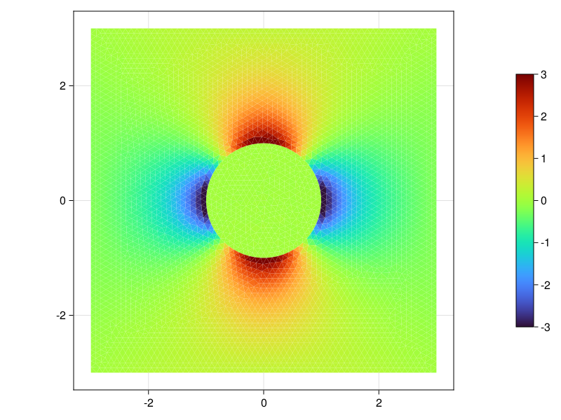
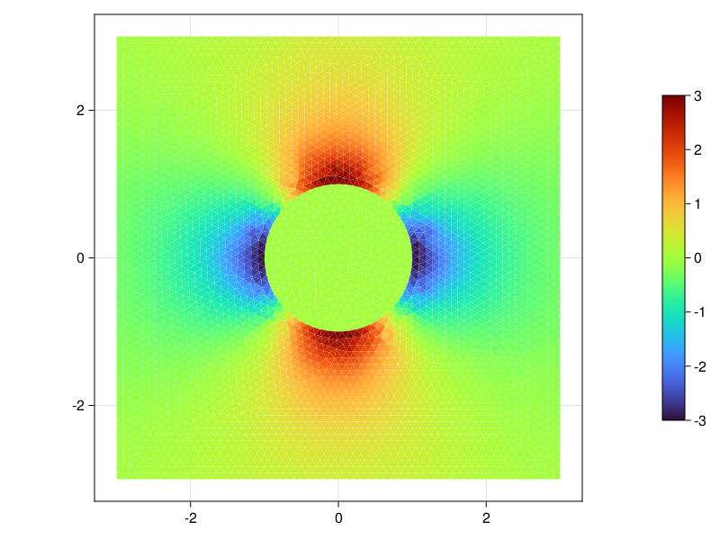
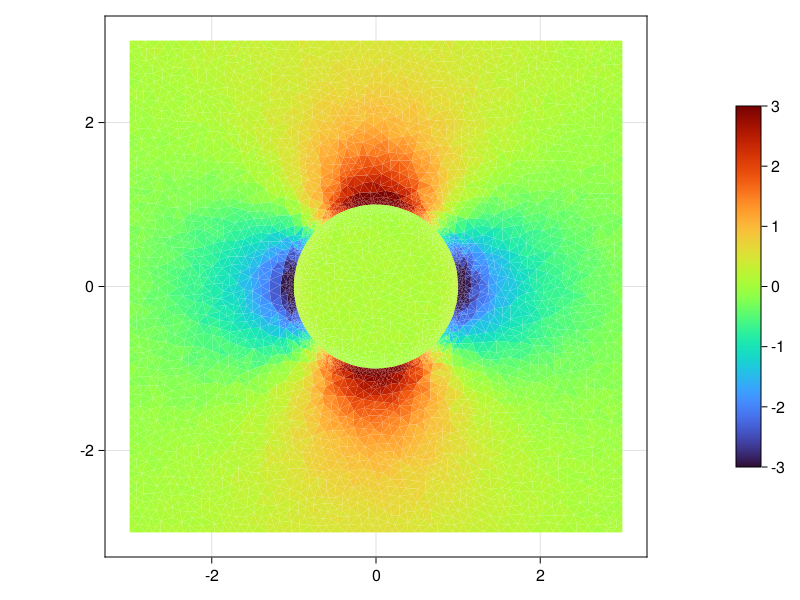

# FCFV_NME23

This repository contains a [*Julia*](https://www.google.com/url?sa=t&rct=j&q=&esrc=s&source=web&cd=&cad=rja&uact=8&ved=2ahUKEwjfmo-y1sD-AhXSIMUKHejOAvsQFnoECAoQAQ&url=https%3A%2F%2Fjulialang.org%2F&usg=AOvVaw0QW6rLOeHgYMIkzdr55cuX)  package and scripts that can be used to reproduce results presented in the publication:
**A face-centred finite volume method for high-contrast Stokes
interface problems**
by R. Sevilla and T. Duretz to be published in *International Journal for Numerical Methods in Engineering*.

# Installation
1. Clone/Download the repository
2. Run Julia from within the folder 
3. In Julia's REPL switch to package mode: type `]`
4. Activate the environement: type `activate .`
5. Install all necessary dependencies: type `instantiate`

# Viscous inclusion test

The example code can be used to simulate incompressible Stokes flow with a discontinuous viscosity field. The model configuration ([ViscousInclusion.jl](./examples/ViscousInclusionFCFV.jl)) accounts for a viscous inclusion in a viscous matrix under general shear conditions, for which a full flow-field analytical solution exists ([Schmid & Podladchikov, 2003](https://academic.oup.com/gji/article/155/1/269/713923)).

 The boundary conditions include 1 Neumann boundary and 3 Dirichlet boundaries:
```julia 
    BC          = [2; 1; 1; 1] # South/East/North/West --- 1: Dirichlet / 2: Neumann
``` 
The inclusion has a viscosity hundred times smaller than the matrix:
```julia
    η           = [1.0 1e-2]   # Viscosity matrix/inclusion
```

1. An example of pressure field computed with a **gradient formulation** and a mesh generated with advancing front technique (in house mesher):
```julia
    # Numerics
    Mesher      = :AdvancingFront          # :Delaunay / :AdvancingFront (load external mesh)
    mesh_res    = :MedRes                  # :LowRes / MedRes / HighRes     
    solver      = :PowellHestenesLU        # :CoupledBackslash / :=PowellHestenesCholesky / :=PowellHestenesLU
    Formulation = :Gradient                # :Gradient / :SymmetricGradient
    τr          = 2                        # Stabilisation
    γ           = 1e5                      # Penalty factor for Powell-Hestenes solvers
    ϵ           = 1e-8                     # Tolerance of Powell-Hestenes solvers 
```


2. An example of pressure field computed with a **gradient formulation** and a Delaunay mesh (Triangle, Shewchuk):
```julia
    # Numerics
    Mesher      = :Delaunay                # :Delaunay / :AdvancingFront (load external mesh)
    solver      = :PowellHestenesLU        # :CoupledBackslash / :=PowellHestenesCholesky / :=PowellHestenesLU
    Formulation = :Gradient                # :Gradient / :SymmetricGradient
    τr          = 2                        # Stabilisation
    γ           = 1e5                      # Penalty factor for Powell-Hestenes solvers
    ϵ           = 1e-8                     # Tolerance of Powell-Hestenes solvers 
```


3. An example of pressure field computed with a **symmetric gradient formulation** and a mesh generated with advancing front technique (in house mesher):
```julia
    # Numerics
    Mesher      = :AdvancingFront          # :Delaunay / :AdvancingFront (load external mesh)
    mesh_res    = :MedRes                  # :LowRes / MedRes / HighRes     
    solver      = :PowellHestenesCholesky  # :CoupledBackslash / :=PowellHestenesCholesky / :=PowellHestenesLU
    Formulation = :SymmetricGradient       # :Gradient / :SymmetricGradient
    τr          = 2                        # Stabilisation
    γ           = 1e5                      # Penalty factor for Powell-Hestenes solvers
    ϵ           = 1e-8                     # Tolerance of Powell-Hestenes solvers 
```


4. An example of pressure field computed with a **symmetric gradient formulation** and a Delaunay mesh (Triangle, Shewchuk):
```julia
    # Numerics
    Mesher      = :Delaunay                # :Delaunay / :AdvancingFront (load external mesh)
    solver      = :PowellHestenesCholesky  # :CoupledBackslash / :=PowellHestenesCholesky / :=PowellHestenesLU
    Formulation = :SymmetricGradient       # :Gradient / :SymmetricGradient
    τr          = 2                        # Stabilisation
    γ           = 1e5                      # Penalty factor for Powell-Hestenes solvers
    ϵ           = 1e-8                     # Tolerance of Powell-Hestenes solvers 
```

